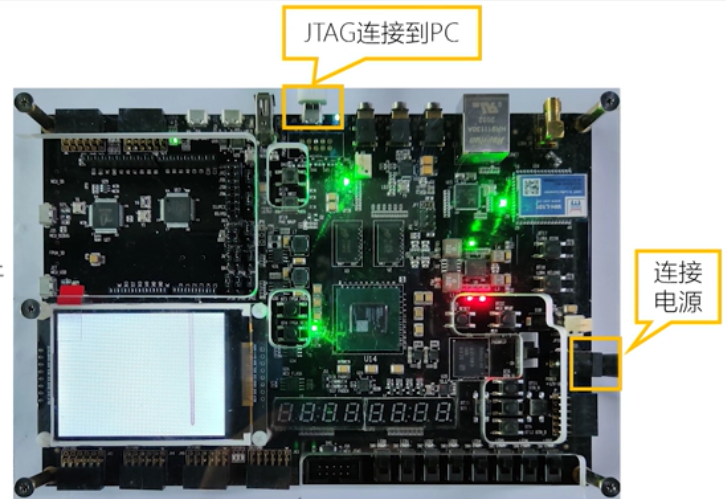
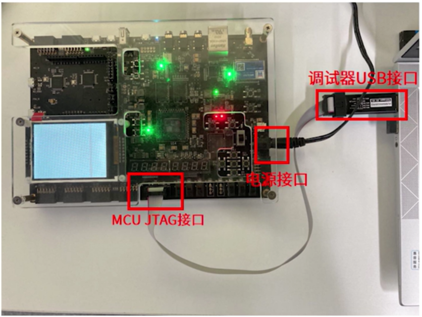

# Hummingbird E603 RISC-V 处理器实验手册

## 实验简介

### 实验目的
本实验旨在通过实际操作，掌握基于 Hummingbird E603 RISC-V 处理器的嵌入式系统开发流程，包括：
1. 学习 FPGA 开发板的基本连接与配置
2. 掌握 Nuclei SDK 工具链的使用方法
3. 实践 RT-Thread 实时操作系统的编译、下载与调试
4. 理解嵌入式文件系统的基本原理与应用

### 实验环境要求
- **硬件环境**：
  - Nuclei DDR200T 评估板
  - Hummingbird Debugger Kit 调试器
  - 电脑（Windows 或 Linux 系统）
  - USB 数据线、JTAG 连接线

- **软件环境**：
  - Vivado 工具（用于 FPGA 固件烧录）
  - 串口通信工具（Tera Term、minicom 等）
  - 本项目提供的工具链（包含在 `toolchain` 目录中）

### 实验器材清单
| 器材名称 | 数量 | 备注 |
|---------|------|------|
| DDR200T 开发板 | 1 | Nuclei FPGA 评估板 |
| Hummingbird Debugger Kit | 1 | 调试器套件 |
| 12V 电源适配器 | 1 | 开发板供电 |
| USB  数据线 | 1 | FPGA 固件烧录 |

## 实验准备

### 项目结构说明
解压项目文件后，确保目录结构如下：

```
.
├── e603_hbird-main
│   ├── design          # RTL 设计文件
│   ├── doc            # 技术文档
│   ├── fpga           # FPGA 相关文件
│   ├── nuclei-sdk     # Nuclei SDK
│   ├── prebuilt       # 预编译文件
│   │   └── bitstream
│   │       ├── e603_ddr200t.bit
│   │       └── e603_ddr200t.mcs
│   ├── README.md
│   └── syn           # 综合文件
├── README.md
└── toolchain
    ├── SSCOM32.exe    # Windows 串口工具 （Linux无此文件）
    ├── env-windows    # Windows 环境配置工具 （Linux无此文件）
    ├── build-tool     # 构建工具 （Linux无此文件）
    ├── gcc           # RISC-V 工具链
    └── openocd       # OpenOCD 调试工具
```

**重要**：项目路径不能包含中文，否则可能导致工具链异常。

### 工具链介绍
本项目已集成完整的开发工具链：
- **RISC-V 编译器**：`riscv64-unknown-elf-gcc`
- **调试器**：`riscv64-unknown-elf-gdb`
- **编程工具**：`openocd`
- **串口工具**：SSCOM32（Windows）或 minicom（Linux）

### 开发板连接
开发板连接示意图：



## 实验一：环境配置与固件烧录

### 实验目标
1. 掌握 Vivado 工具的基本操作
2. 完成 FPGA 固件烧录
3. 配置串口通信环境
4. 掌握 MCU 调试方法

### 实验步骤

#### 步骤 1：FPGA 固件烧录（如需）
如果开发板尚未烧录 E603 SoC 固件，需要执行以下操作：

1. 连接开发板电源和 FPGA JTAG 接口
2. 打开 Vivado 工具，进入 Hardware Manager
3. 右键检测到的 `xc7a200t` 设备，选择 "Add Configuration Memory Device"
4. 搜索并选择 `n25q128-3.3v-spi-x1_x2_x4` Flash 芯片
5. 右键该 Flash，选择 "Program Configuration Memory Device"
6. 选择文件：`e603_hbird-main/prebuilt/bitstream/e603_ddr200t.mcs`
7. 确认烧录，等待完成

#### 步骤 2：调试器连接
1. 断开 FPGA JTAG 连接
2. 将 Hummingbird Debugger Kit 连接到开发板MCU JTAG接口和电脑
   - **注意**：两端接口均有正反之分，请正确连接
3. Windows 系统通过设备管理器确认 COM 端口号
4. Linux 系统使用命令：
   ```bash
   lsusb
   ls /dev/ttyUSB*
   ```

#### 步骤 3：串口工具配置
1. **Windows**：
   - 打开 SSCOM32 或 Tera Term
   - 选择对应的 COM 端口
   - 设置波特率：115200
   - 数据位：8，停止位：1，无校验

2. **Linux**：
   ```bash
   # 添加用户到 dialout 组（如需）
   sudo usermod -aG dialout $USER
   # 重新登录生效
   
   # 使用 minicom
   minicom -D /dev/ttyUSB* -b 115200
   ```

### 实验验证
- 串口工具成功打开，无乱码显示（若原先MCU FLASH内有已经烧写好的程序，按下MCU RESET键可以接收到对应程序的输出）

## 实验二：RT-Thread Nano 系统编译与运行

### 实验目标
1. 配置 Windows/Linux 开发环境
2. 编译 RT-Thread Nano 系统
3. 将程序上传到开发板并验证运行

### 实验步骤

#### 步骤 1：环境配置

**Windows 环境**：
1. 运行 `.\toolchain\env-windows\env.exe`
2. 等待环境配置完成，显示 RT-Thread 欢迎界面
3. 进入 SDK 目录：
   ```bash
   cd ..\..\e603_hbird-main\nuclei-sdk\
   ```
4. 在资源管理器中创建 `setup_config.bat` 文件，内容：
   ```batch
   set NUCLEI_TOOL_ROOT=？:\ddr200t\toolchain
   ```
   **注意**：修改路径为实际的 toolchain 路径
5. 执行 `setup.bat` 配置环境

**Linux 环境**：
```bash
cd ./e603_hbird-main/nuclei-sdk
source ./linux_env_setup.sh
```

#### 步骤 2：验证工具链
```bash
where riscv64-unknown-elf-gcc
where openocd
where riscv64-unknown-elf-gdb
```
确认所有工具都位于 `/toolchain` 路径下。

#### 步骤 3：编译 RT-Thread Nano
1. 使用同一终端进入 RT-Thread Nano 示例目录：
   ```bash
   cd application/rtthread/msh
   ```
2. 执行编译命令：
   ```bash
   make clean SOC=evalsoc CORE=ux600fd BOARD=nuclei_fpga_eval all
   ```
3. 编译成功后生成 `rtthread_msh.elf` 文件

#### 步骤 4：程序上传
```bash
make clean SOC=evalsoc CORE=ux600fd BOARD=nuclei_fpga_eval DOWNLOAD=flash upload
```

#### 步骤 5：运行验证
1. 观察开发板 LED0 指示灯亮起
2. 串口工具显示启动信息：
   ```
   Nuclei SDK Build Time: Mar  4 2026, 17:27:00 
   Download Mode: FLASH CPU Frequency 50000035 Hz 
   CPU HartID: 0
   Hello RT-Thread!
   // 若编译的是msh版本
   \ | /
   - RT -     Thread Nano Operating System
   / | \     _._._ build _ _
   2006 - 2024 Copyright by RT-Thread team
   msh>
   ```

### 实验记录
| 步骤 | 预期结果 | 实际结果 | 备注 |
|------|----------|----------|------|
| 环境配置 | 工具链验证通过 | | |
| 编译 | 生成 .elf 文件 | | |
| 上传 | 上传成功提示 | | |
| 运行 | 串口输出启动信息 | | |

## 实验三：RT-Thread 5.2 系统编译与运行

### 实验目标
1. 了解 RT-Thread 5.2 的新特性
2. 实践文件系统操作
3. 掌握 Shell 命令的使用

### 实验步骤

#### 步骤 1：进入实验目录
按照实验二的步骤，进入另一个实验目录
```bash
cd application/rtthread_5_2/msh
```

#### 步骤 2：查看配置文件
查看 `rtconfig.h` 文件，了解 RT-Thread 5.2 的配置选项：
- 基本内核功能配置
- 内存管理配置
- 设备驱动配置
- 文件系统配置

#### 步骤 3：编译程序
```bash
make clean SOC=evalsoc CORE=ux600fd BOARD=nuclei_fpga_eval all
```

#### 步骤 4：程序上传
```bash
make clean SOC=evalsoc CORE=ux600fd BOARD=nuclei_fpga_eval DOWNLOAD=flash upload
```
成功上传后，串口工具会出现类似Nano版本的欢迎界面，内容为
   ```
   Nuclei SDK Build Time: Mar  4 2026, 17:27:00 
   Download Mode: FLASH CPU Frequency 50000035 Hz 
   CPU HartID: 0
   Hello RT-Thread!
   // 若编译的是msh版本
   \ | /
   - RT -     Thread Operating System
   / | \     _._._ build _ _
   2006 - 2024 Copyright by RT-Thread team
   msh>
   ```

#### 步骤 5：文件系统实验
为了可选择性，在`rtconfig.h`中默认关闭了设备系统和文件系统，按照提示取消注释以启用相应的功能。
程序运行后，通过串口观察文件系统操作：
1. RAM 文件系统创建与挂载
2. 文件创建与写入
3. 文件读取与显示

预期额外输出：
```
[OK] ramfs created
[OK] ramfs mounted to /
[OK] /test.txt created
[OK] Read 29 bytes: Hello RT-Thread FileSystem!
=== ramfs Ready ===
```

由于本次实验中挂载的文件系统是ramfs，导致了文件无法断点后存储，且没有实现目录功能。
#### 步骤 6：Shell 功能测试
在串口终端中输入 Shell 命令：
```bash
# 查看线程信息
ps

# 查看内存使用情况
free

# 查看系统版本
version

# 检查其他可用指令
help
```

### 实验分析
RT-Thread 5.2 相比 Nano 版本提供了更丰富的功能：
- **完整的设备驱动框架**
- **ram版本文件系统支持**
- **增强的 Shell 功能**
- **更完善的内存管理**

## 实验四：调试与故障排除

### 实验目标
1. 掌握 GDB 调试方法
2. 学习常见问题解决方法
3. 了解性能优化技巧

### 实验步骤

#### 步骤 1：启动调试会话
在相应的项目路径下，从env工具或者终端执行
```bash
make clean SOC=evalsoc CORE=ux600fd BOARD=nuclei_fpga_eval DOWNLOAD=ilm debug
```
按下 Enter 键进入 GDB 调试界面。

#### 步骤 2：基本调试命令

注意，在测试过程有时会出现程序执行跳过断点的情况，建议断点不要一次打过远，如果是线程函数请首先在相应的线程入口函数处进行调试。
```gdb
# 重新加载
load

# 手动复位
set $pc=0x20000000     # 如果下载时选择 DOWNLOAD=flash
set $pc=0x60000000     # 如果下载时选择 DOWNLOAD=ilm

# 设置断点
break entry

# 运行程序
continue

# 单步执行
step
next

# 查看变量
print variable_name

# 继续执行
continue

# 退出调试
quit
```

#### 步骤 3：调试复位操作
如果调试过程中使用 FPGA_RST 按键导致调试器丢失信号，使用以下命令复位：
```gdb
# 确保出现 (gdb) 提示符
load                    # 重新载入 elf 文件
set $pc=0x20000000     # 如果下载时选择 DOWNLOAD=flash
set $pc=0x60000000     # 如果下载时选择 DOWNLOAD=ilm
```

#### 步骤 4：性能分析
1. 使用 `perf` 命令分析程序性能
2. 查看缓存命中率
3. 分析函数调用关系

### 常见问题与解决方法

#### 问题 1：串口无输出
- **可能原因**：波特率设置错误、串口线连接错误、程序未运行
- **解决方法**：
  1. 确认波特率为 115200
  2. 检查串口线连接
  3. 确认程序已上传并运行
  4. openocd会自动识别对应的串口，保证烧录程序正常，若串口工具无法找到对应串口，请先尝试烧录项目`e603_hbird-main/nuclei-sdk/application/baremetal/cpuinfo`保证MCU至少会有程序输出。

#### 问题 2：编译失败
- **可能原因**：环境变量未配置、路径包含中文、工具链缺失
- **解决方法**：
  1. 重新执行环境配置脚本
  2. 检查项目路径是否包含中文
  3. 验证工具链完整性

#### 问题 3：上传失败
- **可能原因**：调试器未连接、Flash 芯片问题
- **解决方法**：
  1. 检查调试器连接
  2. 确认 Flash 芯片型号

#### 问题 4：内存不足
- **可能原因**：程序过大、堆栈设置不合理
- **解决方法**：
  1. 优化程序大小
  2. 关闭不必要的功能模块
  3. 用户自行编写的程序也属于内存的一部分，请合理使用，注意保留main.c文件

## 实验总结与扩展

### 实验结果分析
通过本系列实验，您应该已经掌握：
1. Hummingbird E603 RISC-V 处理器的基本开发流程
2. RT-Thread 实时操作系统的编译与调试方法
3. 嵌入式文件系统的原理与应用
4. 常见问题的诊断与解决方法

### 扩展实验：自定义应用程序开发
1. 在 `application` 目录下创建新的应用程序
2. 编写自定义的 Makefile 和 npk.yml 文件
3. 实现特定的功能模块，在`e603_hbird-main/nuclei-sdk/application/rtthread_5_2/msh`路径下有已经写好的测试文件`*.c_`，去掉文件结尾的`_`即可正常编译进入rtthread，在msh中执行`help`找到对应的测试名称。也可以参考其结构编写自己的应用程序。

### 参考资料
1. [Nuclei 官方网站](https://www.nucleisys.com/)
2. [RT-Thread 文档中心](https://www.rt-thread.org/document/site/)
3. [RISC-V 指令集手册](https://riscv.org/technical/specifications/)
4. [Hummingbird E603 技术文档](doc/)

---

## 附录

### 附录 A：常用命令速查表

| 命令 | 功能 | 示例 |
|------|------|------|
| `make clean all` | 清理并编译 | `make clean SOC=evalsoc CORE=ux600fd BOARD=nuclei_fpga_eval all` |
| `make upload` | 上传到 Flash | `make clean SOC=evalsoc CORE=ux600fd BOARD=nuclei_fpga_eval DOWNLOAD=flash upload` |
| `make debug` | 启动调试 | `make clean SOC=evalsoc CORE=ux600fd BOARD=nuclei_fpga_eval DOWNLOAD=ilm debug` |
| `where` | 查找工具路径 | `where riscv64-unknown-elf-gcc` |

### 附录 B：RT-Thread 配置选项说明

| 配置选项 | 功能 | 建议值 |
|----------|------|--------|
| `RT_USING_DFS` | 启用文件系统 | 根据需求开启 |
| `RT_USING_DEVICE` | 启用设备框架 | 根据需求开启 |
| `RT_HEAP_SIZE` | 堆大小 | 2048-8192 |
| `RT_MAIN_THREAD_STACK_SIZE` | 主线程栈大小 | 2048 |

### 附录 C：硬件连接检查清单
- [ ] 开发板电源连接正确
- [ ] 调试器连接稳固
- [ ] 串口线连接正确
- [ ] 所有接口方向正确
- [ ] 电源指示灯正常